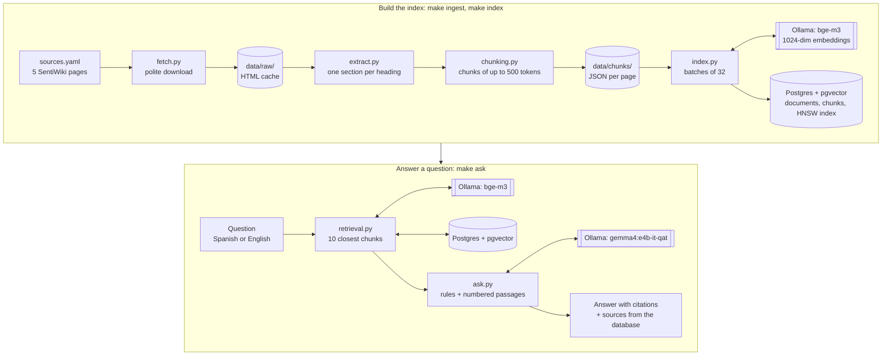

# sentinel1-rag

A small, local and free RAG (retrieval-augmented generation) system that answers technical questions about the Sentinel-1 radar mission (acquisition modes, GRD and SLC products, processing levels…) using the [Sentinel-1 SentiWiki](https://sentiwiki.copernicus.eu/web/sentinel-1) as its only source. Every answer cites the sections it comes from, with links.

Everything runs on one machine: Ollama serves the embedding model (`bge-m3`) and the language model (`gemma4:e4b-it-qat`), and PostgreSQL with pgvector stores and searches the vectors. Questions can be asked in Spanish or English about the English documentation.

```
$ make ask Q="¿Qué diferencia hay entre un producto GRD y uno SLC?"

Los productos SLC son datos SAR enfocados, geo-referenciados usando datos de órbita y actitud del
satélite, y se proporcionan en geometría de rango de línea de vista [9]. Los productos SLC incluyen
muestras complejas (real e imaginaria) que preservan la información de fase, y están en orientación
de cero Doppler, donde cada fila de píxeles representa puntos a lo largo de una línea perpendicular
a la trayectoria del satélite [9]. Los productos SLC están en rango de inclinación [2].

Los productos GRD son productos detectados en rango terrestre [2]. Los productos GRD están
clasificados por resolución (Full, High o Medium) [1, 4]. Para los productos GRD, la resolución
corresponde al valor de rango medio a altitud media en órbita, promediado sobre todos los barridos [1, 2].

En resumen:
*   **SLC:** Proporciona datos SAR enfocados en geometría de rango de inclinación, preservando la información de fase [9].
*   **GRD:** Proporciona datos en rango terrestre y está clasificado por resolución [2, 1].

Sources:
[1][2][4] S1 Products > Level-1 Products
    https://sentiwiki.copernicus.eu/web/s1-products#Level-1-Products
[9] S1 Processing > L1 Algorithms > Single Look Complex (SLC)
    https://sentiwiki.copernicus.eu/web/s1-processing#Single-Look-Complex-(SLC)

gemma4:e4b-it-qat: 2901 prompt tokens, 241 answer tokens, 68.7s (60s of it loading the model)
```

This is real output from a run on a clean clone (line breaks added). The question is in Spanish, the documentation is in English, and the answer comes back in Spanish. Each `[n]` points to one of the passages the model was given, and the source list is built by the code from the database, so the model can cite the wrong passage but never invent a section or a URL.

## How it works



**Building the index** happens once, offline:

1. **Download** (`make ingest`): the 5 pages of the Sentinel-1 subtree of the SentiWiki are downloaded politely (robots.txt respected, 1 request per second, a User-Agent that names the project) and cached in `data/raw/`, so later runs work offline.
2. **Extract:** each page is split into sections at its headings. Each section keeps its heading path (`S1 Mission > Acquisition Modes > Interferometric Wide Swath`) and its anchor, which becomes the citation link. Tables are kept as one line per row.
3. **Chunk:** a section of up to 500 tokens is one chunk. Longer sections are cut between sentences, table rows or list items into chunks of similar size (up to 400 tokens), each repeating up to 60 tokens of the previous one. The result is 195 chunks from 89 sections.
4. **Embed and store** (`make index`): each chunk, prefixed with its heading path, is turned into a 1024-number vector by `bge-m3` and stored in Postgres next to its text, section and URL. Indexing is idempotent: a page is re-embedded only when its text, the chunking settings or the embedding model change.

**Answering a question** happens on every `make ask`:

1. The question is embedded with the same model. `bge-m3` is multilingual, so a Spanish question lands close to the English passage that answers it.
2. Postgres returns the 10 chunks with the smallest cosine distance to the question. An HNSW index is in place, although at 195 chunks Postgres prefers an exact scan, which takes about 1 ms; the index is there to learn how approximate search works.
3. The prompt gives Gemma rules in the system turn (use only the passages, cite them as `[n]`, say when the answer is not there, answer in the question's language) and the 10 numbered passages followed by the question in the user turn.
4. The code reads the `[n]` citations in the answer and prints the cited sections with their URLs.

Every design choice, with the alternatives weighed and what was measured, is recorded in [docs/DECISIONS.md](docs/DECISIONS.md).

## Retrieval results

`make eval` runs 19 labelled questions through the same retrieval function that `make ask` uses and checks where the sections that answer each question end up in the ranking. It does not need the language model and takes a few seconds.

- **hit@k:** the share of questions where at least one chunk from a correct section is among the first k results, that is, whether the model received what it needed.
- **MRR@10:** the mean of 1/rank of the first correct chunk (1st scores 1, 2nd 0.5, 4th 0.25), counted as 0 below rank 10 because `make ask` passes only 10 chunks to the model.

| Questions | hit@1 | hit@3 | hit@5 | hit@10 | MRR@10 |
|---|---|---|---|---|---|
| **All (19)** | 0.684 | 0.789 | 0.895 | **0.947** | **0.766** |
| Written without reading the pages (5) | 0.400 | 0.600 | 0.600 | 0.800 | 0.522 |
| Drafted from the text (14) | 0.786 | 0.857 | 1.000 | 1.000 | 0.854 |

**hit@10 is 0.947 and MRR@10 0.766 over 19 questions**, from [eval/results/2026-10-10T130918-top-k-10.json](eval/results/2026-10-10T130918-top-k-10.json). A run from a clean clone, with the pages downloaded again, reproduced these numbers with the same ranking and distances for every question.

How to read these numbers:

- **The 5 questions written without reading the pages are the realistic score.** The other 14 were drafted after reading the sections that answer them, so they reuse the documentation's wording, which makes them easy for an embedding search. Each question records how it was written, and the eval reports both groups.
- **The set is small.** One question moves hit@k by 0.053 overall and by 0.2 within the 5 blind questions, so only differences of several questions mean anything.
- **Top-k was chosen on these same questions.** With the top 5 (hit@5 0.895, MRR@5 0.761) the project's own example question never received the sections that explain SLC and GRD, which ranked 9th and 11th. Raising k to 10 gives the answer above. There is no held-out set, so this change was kept for the better answer, not for the one-question gain.

Each results file holds the rank of every question and the 20 chunks retrieved for it. The labelling rule and the questions left out are described in [D-017](docs/DECISIONS.md#d-017-retrieval-eval-section-level-labels-the-real-retrieval-mrr-cut-at-the-top-k) and [D-018](docs/DECISIONS.md#d-018-top-k-raised-from-5-to-10).

## Running it on WSL

It was built and tested on Windows 10 with WSL2 (Ubuntu 24.04), an NVIDIA GTX 1070 with 8 GB of VRAM and 10 GB of RAM for WSL. It has not been tested on other machines, or with Ollama running on the CPU only.

### Requirements

- **Docker Engine** with the Compose plugin, running inside WSL (tested with Engine 29.8 and Compose 5.5).
- **[uv](https://docs.astral.sh/uv/)**, GNU Make and git. uv installs Python 3.12 and the dependencies on the first run.
- **[Ollama](https://ollama.com) 0.30.5 or newer**, installed inside WSL (tested with 0.40.1). On WSL2 it reaches the GPU through the Windows NVIDIA driver, which is the only thing needed on the Windows side. Ollama supports Pascal cards such as the GTX 1070 from driver 570 on.
- **GPU memory and disk:** with both models loaded, the test machine used 5.4 of its 8 GiB of VRAM, desktop included. The models take 7.3 GB of disk.

### Setup

```bash
# Ollama and the two models (7.3 GB in total)
curl -fsSL https://ollama.com/install.sh | sh
ollama pull gemma4:e4b-it-qat
ollama pull bge-m3

# The project
git clone https://github.com/mmartinsie/sentinel1-rag.git
cd sentinel1-rag
make up       # Postgres + pgvector in Docker, waits until it accepts connections
make ingest   # downloads the 5 pages into data/raw/ and chunks them into data/chunks/
make index    # embeds the 195 chunks and stores them in Postgres
make ask Q="¿Qué diferencia hay entre un producto GRD y uno SLC?"
make eval     # retrieval metrics, saved in eval/results/
```

Measured on a clean clone: `make up` 13 s, `make ingest` 10 s, `make index` 33 s (including loading `bge-m3`) and the first `make ask` 69 s, of which 60 s were spent loading Gemma from a hard disk. With the models loaded, an answer takes about 4–7 s. Ollama unloads a model after 5 idle minutes, so the next question pays the load time again.

To check that the models run on the GPU, run `ollama ps` while asking a question: both models should show `100% GPU`. After a WSL restart, Ollama sometimes falls back to the CPU because its GPU discovery times out while the disk is cold. If `journalctl -u ollama -b | grep "inference compute"` shows `library=cpu`, run `sudo systemctl restart ollama`.

### Commands

| Command | What it does |
|---|---|
| `make up` | Starts Postgres + pgvector and waits until it is ready. The database listens on `127.0.0.1:5432` only. |
| `make down` | Stops the database. The data is kept. |
| `make ingest` | Downloads the pages in `sources.yaml` (once; cached in `data/raw/`) and writes the chunks to `data/chunks/`. |
| `make index` | Embeds the chunks and stores them. Pages that have not changed are skipped. |
| `make ask Q="..."` | Answers a question with cited sources. `ARGS=--show-context` also prints the retrieved chunks and their distances. |
| `make eval` | Measures retrieval. `ARGS="--label name"` names the run; `ARGS="--top-k 5"` scores another k. |
| `make clean` | Stops the database and deletes its volume and `data/`. |

The defaults work without configuration. `OLLAMA_URL` and `DATABASE_URL` override where the code finds Ollama and Postgres, and `POSTGRES_USER`, `POSTGRES_PASSWORD`, `POSTGRES_DB` and `POSTGRES_PORT` in a `.env` file override the database settings.

## Project layout

```
sources.yaml              the pages in the corpus
db/schema.sql             tables, constraints and the HNSW index
src/sentinel1_rag/
  fetch.py                polite downloader with a local cache
  extract.py              HTML to sections with heading paths and anchors
  chunking.py             sections to chunks
  ingest.py               make ingest
  ollama.py               minimal REST client for /api/embed and /api/chat
  db.py                   database connection
  index.py                make index
  retrieval.py            top-k search, shared by ask and eval
  ask.py                  make ask: prompt, answer and citations
  evaluate.py             make eval
eval/questions.yaml       19 questions labelled with the sections that answer them
eval/results/             the eval runs cited in the docs
docs/DECISIONS.md         every decision, its alternatives and what was verified
docs/steps/               a plain-English write-up of each build step
docs/PROGRESS.md          build log and notes for resuming work
```

## Limitations

- **Small eval set.** 19 questions, only 5 of them written without reading the pages, and no held-out set (see [Retrieval results](#retrieval-results)).
- **Some product sections rank low.** For questions about products, chunks from the `S1 Products` page outrank the `S1 Processing > L1 Algorithms` sections that explain SLC and GRD. "¿Qué información contiene un producto Sentinel-1 SLC?" still misses: the first correct section is 16th, behind an ETAD section that keeps mentioning "standard SLC product".
- **Questions about three or more things.** One search cannot get every part into the top 10. For "the differences between Level-0, Level-1 and Level-2", the three sections ranked 2nd, 3rd and 14th, so the model never sees Level-2.
- **No distance threshold for "not found".** The distances of unanswerable questions overlap with those of answerable ones, so the model always receives 10 passages and has to decide on its own that the answer is not there. It did so every time for the question about the mission's cost.
- **Partial answers do not say what is missing.** "¿Cómo se exportan los resultados a GeoTIFF?" is not answered by the documentation. Gemma replies with nearby facts (the products are GeoTIFF files), correctly cited, but does not say that the export itself is not covered, although the prompt asks it to.
- **A small model.** `gemma4:e4b-it-qat` has about 4.5B effective parameters. Answers can be shallow, vary slightly between runs (temperature 0.2, no fixed seed) and have small formatting quirks, such as `$180^\circ$` instead of 180°.
- **A frozen, site-specific corpus.** Cached pages are never refreshed: delete `data/raw/` or run `make clean` to download them again. The extractor is written for the SentiWiki's layout and stops with "unexpected page layout" if it changes.
- **HNSW is not needed at this size.** With 195 chunks the Postgres planner prefers an exact scan (about 1 ms). The index is there to learn how it works.
- **No automated tests.** The checks run while building it are recorded under "Verified" in [docs/DECISIONS.md](docs/DECISIONS.md).

## Extensions (not implemented)

Ordered by expected value:

1. **Lexical baseline and hybrid search:** Postgres full-text search vs. vectors on the same eval, then a hybrid of both. SAR acronyms (GRD, SLC, IW, EW, ETAD) are where lexical search usually wins.
2. **Technical PDFs** from the Sentinel-1 document library.
3. **Agent** with a `search_scenes` tool over the Copernicus Data Space Ecosystem STAC API, with a hand-written agent loop.
4. **MCP server** exposing `search_docs` and `search_scenes`.
5. **OpenSearch k-NN** instead of pgvector, comparing results.

Smaller experiments that `make eval` can measure in minutes, not run yet: merging the 15 chunks under 100 tokens with their neighbours, another chunk size, embedding chunks without the heading-path prefix, adding the SentiWiki's POD or Glossary pages, and a reranker over the top 20.

## License

The code is under the [MIT License](LICENSE). The SentiWiki documentation is not part of this repository: `make ingest` downloads it from the site, and it belongs to its publishers.
